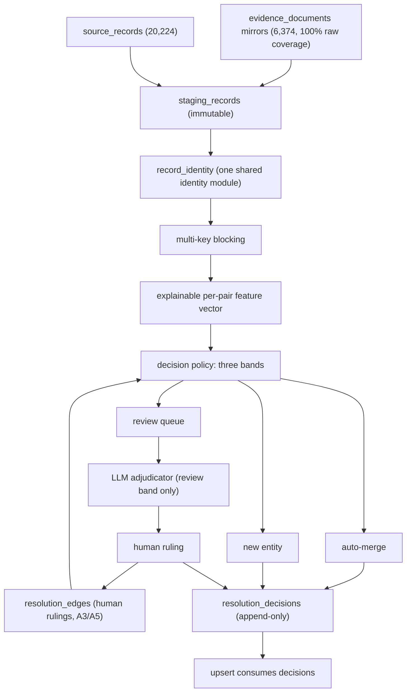

# Spec: Entity resolution core (RC)

Linear: not yet filed. Status: **specified, not started** (4 Aug 2026).
Prerequisite: the Guardrails epic (Linear REZ-57) must merge first — see
"Dependencies" below.

## Problem

Every supplier identity decision the platform has ever made was made by
`_find_existing` in `etl/core/upsert.py` (lines 176–266): five sequential
passes, first match wins, ending in a trigram prefilter capped at 50
candidates.

```
    cur.execute(
        """select id, company_name_norm
             from public.suppliers
            where company_name_norm %% %s
            limit 50""",
        (norm,),
    )
```

Three structural consequences, all observed in production:

1. **No score is retained.** A pair is either joined or not. When a join turns
   out to be wrong there is no record of why it was made, so the only repair
   path is a bespoke ops script — nine of them exist.
2. **No memory.** Human rulings (Sarada Knit Wear = SARDA KNITWEAR; Sarada
   Fashions is a different company; Anika is not ANITA; Bando is not BRAND)
   live in run logs. The matcher re-derives the same wrong answer next run.
3. **One blocking key.** Candidate generation is trigram-over-name only, capped
   at 50. A supplier whose name drifted (502 found drifted during REZ-56) is
   invisible to it even when registry number, phone and address all agree.

This spec replaces the resolution decision. It does not replace acquisition,
parsing, or the evidence layer.

## Decisions recorded (founder, 4 Aug 2026)

**Tool approval under Hard Rule 4.** An LLM adjudicator is approved for the
**review band only**. It may never auto-merge; it may never override a stored
human ruling; every call persists its rationale next to the feature vector that
triggered it. Firecrawl `/v2/extract` is **not** approved — parsing stays
deterministic and in our own code, per Hard Rule 5.

**Placement.** Resolution is a **separate batch stage** over an immutable
staging table. `upsert_supplier_with_source` consumes decisions rather than
making them. This is what makes shadow-running and replay possible; an inline
resolver cannot be evaluated without writing to production.

## Verified findings (production, 4 Aug 2026 — every number below re-queried)

### Replay is possible with zero re-scraping

- `evidence_documents`: **6,374** rows. **4,407** carry `raw_html_mirror_url`
  and **1,967** carry `file_mirror_url` — 4,407 + 1,967 = 6,374, so raw payload
  coverage is **100%** with no gaps. `markdown_mirror_url` is populated on zero
  rows; the raw HTML and file mirrors are the archive.
- `source_records`: **20,224** rows, **all** with non-empty `fields`, spanning
  **13 May – 2 Aug 2026**.

Every phase below can be built and shadow-run against archived payloads at zero
Firecrawl cost. This answers the question the founder raised earlier: a rebuild
of the resolution core does **not** require re-scraping.

### Record distribution by source

| Source | Tier | Records | Suppliers touched |
| -- | -- | --: | --: |
| BGMEA | tier2_industry | 5,970 | 5,740 |
| BKMEA | tier2_industry | 5,262 | 2,578 |
| OEKO_TEX | tier3_cert | 2,627 | 2,479 |
| RSC | tier1_gov | 2,315 | 2,241 |
| BGAPMEA | tier2_industry | 1,243 | 1,080 |
| GOTS | tier3_cert | 911 | 878 |
| EPB | tier1_gov | 539 | 531 |
| BTMA | tier2_industry | 528 | 422 |
| WRAP | tier3_cert | 434 | 422 |
| BRAND_HM | tier4_brand | 199 | 199 |
| BRAND_NEXT | tier4_brand | 76 | 76 |
| BRAND_MS | tier4_brand | 69 | 67 |
| BRAND_ASOS | tier4_brand | 44 | 43 |
| SA8000 | tier3_cert | 7 | 6 |

### Blocking key coverage (10,845 published suppliers)

| Key | Covered | % |
| -- | --: | --: |
| Address (`address_raw`) | 10,060 | 92.8 |
| Geocode (join to `address_geocodes` on `address_raw`) | 9,823 | 90.6 |
| Email | 8,795 | 81.1 |
| Phone | 8,641 | 79.7 |
| Any registry key | 7,727 | 71.2 |
| Website | 1,820 | 16.8 |
| `parent_group_name` | 1,348 | 12.4 |

**`suppliers.lat` / `suppliers.lng` are populated on zero rows.** Coordinates
exist only in `public.address_geocodes` (17,973 rows, all with `latitude` /
`longitude`). Geospatial blocking is viable at 90.6% coverage, but **only via a
join to that cache** — a resolver reading `suppliers.lat` would silently find
nothing. Note also that `address_geocodes.address_status = 'ok'` matches zero
rows; do not filter on it.

### Signal quality — what is and is not decisive

**Single-source rate: 7,947 of 10,845 published suppliers (73.3%) hold records
from exactly one source.** Zero suppliers hold none. This is the core risk
number: a supplier corroborated by one register is either genuinely
single-register or one half of an undetected split, and today nothing
distinguishes them.

**Registry-key equality is decisive for BKMEA and NOT for BGMEA.** This is the
single most important design input in this spec.

- BKMEA: **4** registration numbers appear on more than one published supplier.
- BGMEA: **1,196** registration numbers appear on more than one published
  supplier, and **664** published suppliers hold more than one BGMEA number.

BGMEA registration numbers are short integers and are demonstrably shared
across related-but-distinct companies:

| BGMEA reg | Suppliers sharing it |
| -- | -- |
| 2571 | Opex Designers Ltd. / Opex International |
| 641 | Shamoli Garments Ltd. / YSG Bangladesh |
| 6699 | Chorka Apparels Ltd. / CHORKA TEXTILE LTD |

A resolver that treats BGMEA reg equality as identity would merge those pairs.
It must be a **blocking key** (cheap way to find candidates) and a **positive
feature**, never a decisive one. BKMEA reg equality may be decisive.

**Address equality is a group signal, not an identity signal.** 479 normalised
address keys are shared by 1,752 published suppliers, and the largest single
cluster holds **69** suppliers. Merging on shared address would be
catastrophic. Shared address is evidence of a shared campus — which is the
corporate-group signal the Groups epic (REZ-59) is built on — and must act as
an **anti-merge** signal between siblings, exactly as it does for the extension
class today.

**Name-squash collisions are already largely handled.** Only 26 squashed
`company_name_norm` keys collide, covering 52 published suppliers, because
Pass 1.5 (squash equality, added 3 Aug 2026) already absorbs this class.

### Evidence coverage

**6,970 of 10,845 published suppliers (64.3%) hold zero active evidence
claims.** Measured both via `evidence_claims.supplier_id` and via
`subject_id`; both give the same figure. This is the number Linear REZ-82 (D1)
asks someone to produce — it is recorded here so the resolution work and the
Evidence epic share one measurement.

## Architecture



## Data model

Three new tables. All additive; none replace an existing table in this spec.

### `staging_records` (immutable landing)

One row per parsed record per run, written before any identity decision is
made. Never updated, never deleted. Carries the `evidence_document_id` that
produced it so a decision can always be traced back to a raw payload.

Rationale: today a record's pre-resolution state is unrecoverable — by the time
anything is queryable the merge has already happened. Without this table, no
shadow run can be evaluated against what the resolver actually saw.

### `record_identity` (one shared identity computation)

One row per staging record, holding every derived key exactly once:

- `name_norm`, `name_squash`, `name_tokens`
- registry keys: BGMEA, BKMEA, BGAPMEA, BTMA, EPB, RJSC, RSC, cert body
- `address_key` (via `etl/lib/bd_place_lexicon.py`), `geohash` (via
  `address_geocodes`)
- contact keys: phone set, email, email domain
- `owner_name`, `extension_base` (the A7 function)

Rationale: identity is currently recomputed independently in
`etl/core/upsert.py`, in the audit scripts, and in each repair script, so the
definitions drift. One drift already exists and is documented in Linear REZ-67:
`extension_base_name()` and the prefix guard in
`ops/repair_bgmea_conflations.py::_compatible` are two different answers to
"is this name a building". Persisting identity makes drift detectable — the
column either matches the module output or it does not.

### `resolution_decisions` (append-only)

One row per pair evaluated: the two record or supplier ids, the full feature
vector, the band, the outcome, the policy version, and — where the adjudicator
ran — its rationale. Never updated. A policy change writes new rows rather than
mutating old ones, so any two policy versions can be diffed over identical
input.

### Relationship to `resolution_edges`

`resolution_edges` (Linear REZ-63, A3) is **not** duplicated here. It stays the
human-ruling table and acts as a hard override: an edge outranks any score in
either direction. This spec consumes it; the Guardrails epic creates it.

## Decision policy

Three bands, evaluated in this order:

1. **Hard override.** A matching `resolution_edges` row decides, full stop.
   Never scored, never adjudicated, never overridden by a model.
2. **Auto-merge.** Only on decisive identity: same-source `source_ref`
   idempotency, BKMEA registration equality, or exact recomputed slug / squash
   equality. Deliberately narrow.
3. **Review.** Everything above the new-entity floor and below the auto bar.
   The LLM adjudicator proposes here, with rationale, and a human rules.
4. **New entity.** Below the floor.

**Decisive negatives** — these force new-entity regardless of score:

- Registry conflict: both records carry a BKMEA number and the numbers differ.
- Address conflict: both carry a resolved address key and the keys differ.
- Leading-initials conflict: the existing `_leading_initials` guard, which is
  what rejects H. R. TEXTILE against G. R. TEXTILE at a token-sort score of 94.

**Explicitly not decisive**, on the evidence above: BGMEA registration
equality, shared address, shared phone, shared email domain. Each is a
candidate-generation key and a positive feature only. Shared address between
two suppliers that are both group members is an **anti-merge** signal.

## Phases

Each phase is independently shippable and independently verifiable. Per Hard
Rule 2, one phase per session.

### R0 — staging and replay

Add `staging_records`. Build a replay harness that reconstructs today's
`suppliers` table from `source_records` plus the archived mirrors, with no
network access.

*Acceptance:* the harness reproduces the current 10,845 published suppliers
from history alone. Every divergence is enumerated and explained before any
policy work begins. Zero Firecrawl credits consumed.

### R1 — canonical identity

Extract the shared identity module and persist `record_identity` for all 20,224
records.

*Acceptance:* `etl/core/upsert.py`, `ops/audit_cross_register_coverage.py` and
every repair script import identity from one module and compute nothing
themselves. The `extension_base_name` / `_compatible` disagreement list
produced by REZ-67 is resolved to a single definition. A test fails if a stored
identity column disagrees with a fresh computation.

### R2 — blocking and scoring

Multi-key candidate generation over `record_identity` (registry, name 4-gram,
phone, email domain, address key, geohash), replacing the trigram limit-50.
Produce an explainable feature vector per candidate pair.

*Acceptance:* recall measured against the known-positive set — the 37 merge
groups applied in REZ-56, plus the BGMEA repair's 808 stowaways — must exceed
the current matcher's recall on the same set. Every feature is individually
inspectable for any pair. Candidate generation is no longer capped at a
constant.

### R3 — decision policy

Implement the bands and `resolution_decisions`. Wire `resolution_edges` as the
hard override.

*Acceptance:* every known founder ruling is reproduced. Specifically: Sarada
Knit Wear resolves to SARDA KNITWEAR; Sarada Fashions stays separate; Anika
does not resolve to ANITA; Bando does not resolve to BRAND; the three Opex /
Shamoli / Chorka BGMEA-reg pairs stay separate despite the shared key.

### R4 — shadow run

Run the full policy over production history without writing. Produce a
proposed-versus-current diff.

*Acceptance:* a founder-reviewable report listing every supplier the new policy
would merge, split, or leave alone differently from today, with the feature
vector for each. Cutover criteria below must be met.

### R5 — review queue and adjudicator

`/admin/resolution` showing both candidates side by side with the feature
vector. LLM adjudicator scoped to this band, rationale persisted. Human rulings
write back as sticky `resolution_edges`.

*Acceptance:* a human ruling made in the UI survives a subsequent full re-run
untouched. The adjudicator cannot write an edge; only a human can. Every
adjudicated pair stores its rationale.

### R6 — retirement

Retire the ops repair scripts once parity holds.

*Acceptance:* the conflation detector reports OK for a full cycle with no
repair script having been run.

## Cutover criteria (gate on R4)

Do not cut over unless all of these hold on the shadow run:

1. Zero regressions against the known-positive set (REZ-56's 37 groups, the 808
   BGMEA stowaways, and every `resolution_edges` ruling).
2. Zero proposed merges among the 479 shared-address clusters that are not also
   supported by a decisive key.
3. The review band is small enough for a human to clear — target under 500
   pairs on first run.
4. The single-source rate does not rise. Today it is 7,947 (73.3%); a resolver
   that splits more than it joins would push it up.
5. A9's invariant check (Linear REZ-69) passes against the shadow output.

## Dependencies

The Guardrails epic (Linear REZ-57) is a **prerequisite, not a parallel
track**:

- `resolution_edges` (A3, REZ-63) is the override table R3 reads.
- The rulings backfilled by A5 (REZ-65) are R3's and R4's regression fixtures.
- `extension_base_name` (A7, REZ-67) is an input to `record_identity`.
- A9's invariant checks (REZ-69) are what make a cutover reversible.

The Extensions epic (REZ-58) should also be applied first, so that facility
rows are not scored as candidate companies.

## Non-goals

- No change to sanctions screening.
- No declarative Firecrawl source framework — separate spec.
- No change to the evidence layer, acquisition adapters, or any parser.
- No use of Firecrawl `/v2/extract` (not approved).
- No LLM involvement in auto-merge, in parsing, or in overriding a human
  ruling.
- No re-scraping. The archive is complete; see "Replay is possible" above.
